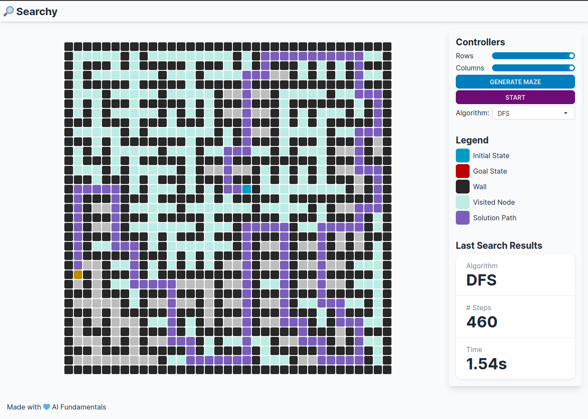

# Searchy

[](https://app.netlify.com/sites/searchy-aif/deploys)

[**Searchy**](https://searchy-aif.netlify.app/) wants to be an environment to test and visualize different problem-solving AI agents (i.e.
**searching algorithms**) upon a simple problem as a fully-observable maze scenario.

This simple project has been developed as part of my studies in the Artificial Intelligence Master's Degree in Pisa, during the lectures of the Artificial Intelligence Fundamentals course. My willingness is to open source this and try to continuously improve and evolve it to support less trivial scenarios. You can find the theory of those concepts in the [2.3 Chapter of the AIMA (Artificial Intelligence: A Modern Approach, 4th ed.)](https://aima.cs.berkeley.edu/).

You can play with it [here](https://searchy-aif.netlify.app/).



## Usage

Even if pretty simple, I want to introduce the basic controls in that section of the README. The idea is to be able to configure your maze choosing the number of **rows** and **columns** of the grid. After that, you can go ahead with the maze generation. Once you have your preferred setup, just select your algorithm of choice and hit that **start** button. Enjoy! 😁
After the first run, you can see below the controls a little section showing some stats about the last search. This section will be expanded with useful infos whenever they come to my mind. That's the section of reference when comparing different algorithms!

## Run Locally

To start the project locally

```bash
  git clone https://github.com/matmont/searchy.git
  cd searchy
  pnpm install
  pnpm run dev
```

## To Do

I want to gather here a kind of roadmap for the app. Feel free to open issues to propose new ones and PRs to start burning those out!

- [ ] Add more algorithms
  - [ ] Genetic algorithms
  - [ ] A\*
  - [ ] Dijkstra's algorithm
- [x] Add more stats
  - [ ] Optimal solution?
- [ ] Draw optimal solution(s)
- [ ] Allows user to change starting player position
- [ ] Allows for multiple goals
- [ ] Add uncertainty/partial observability
